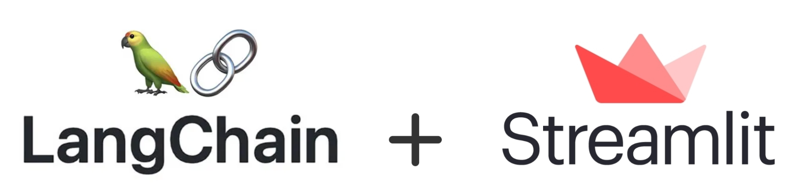

# Chatbot for CSV & TXT File Queries

## Introduction

Welcome to our web application, a state-of-the-art chatbot designed to efficiently extract and interpret information from CSV and TXT files. Whether you're looking to quickly understand file contents or perform mathematical operations, this chatbot has you covered, all while maintaining the context of your conversation.

## Capabilities

- **File Parsing**: The chatbot is proficient at extracting and presenting data from both CSV and TXT files, ensuring you can understand your file contents quickly.

- **Memory of Conversation**: Say goodbye to repeatedly providing the same context. Our chatbot retains memory of the ongoing conversation, enabling a seamless user experience and better understanding of context-based queries.

- **Math Operations**: Need quick calculations based on the extracted data? Our chatbot can execute various math operations, giving you insights without the need for external tools.

## Technologies Behind

- **LangChain**: An integral part of our chatbot's intelligence, LangChain enables efficient language processing and interpretation, making sure the chatbot understands your queries and provides relevant responses.

- **Streamlit**: The backbone of our web application, Streamlit ensures a smooth, responsive, and user-friendly interface, allowing you to interact with the chatbot with ease.

## Conclusion

Our chatbot web application is not just a tool; it's your assistant in understanding and interpreting your CSV and TXT files. Powered by the latest technologies, it promises an unmatched user experience and quick insights. Dive in and experience the future of file interpretation!

