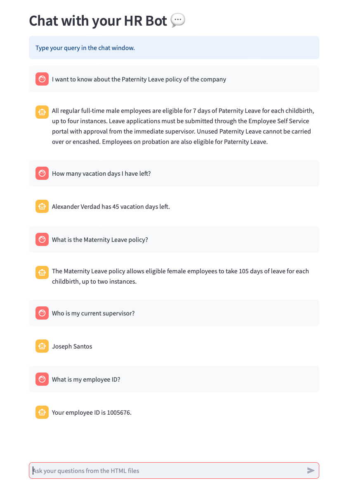
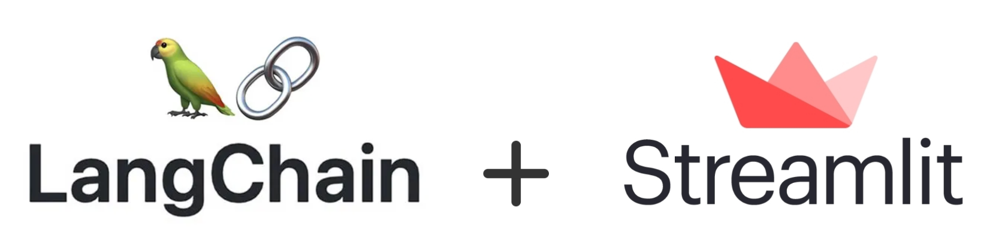

# 🤖 HR Chatbot: Streamlining Human Resources with AI

## 🚀 Introduction

Welcome to the future of Human Resources management – the HR Chatbot! Built with the power of LangChain and Streamlit, this revolutionary chatbot is designed to cater to the multifaceted needs of HR processes, bridging the gap between employees and administrative tasks.

Whether it's handling basic queries about company policies, assisting with leave applications, or offering insights into HR analytics, our HR Chatbot is poised to revolutionize how companies interact with their staff and streamline HR operations.

Dive in 🏊 and discover how automation and artificial intelligence come together to enhance the HR experience for both employers and employees.

## 🔧 Technical Capabilities

- **File Parsing 📁**: The chatbot is capable of extracting and presenting data from both CSV and TXT files, ensuring you can understand your file contents quickly.

- **Memory of Conversation 💬**: The chatbot retains memory of the ongoing conversation, enabling a seamless user experience and better understanding of context-based queries.

- **Math Operations ➕**: The chatbot can execute various math operations, giving you insights without the need for external tools.

## 💡 Technologies Behind

- **LangChain**: LangChain is an open-source framework that makes it easy to develop applications powered by large language models (LLMs). It provides a modular architecture and a set of tools for connecting LLMs to other data sources and external systems.

- **Streamlit**: Streamlit is a Python library that makes it easy to create and share beautiful and interactive web applications. It is built on top of popular Python libraries like NumPy, Pandas, and Matplotlib, and can be used to create a wide variety of web applications, from simple dashboards to complex machine learning apps.

Given that both LangChain and Streamlit are Python-based, integrating them becomes a seamless experience, making the duo a formidable pair in the AI development landscape.

