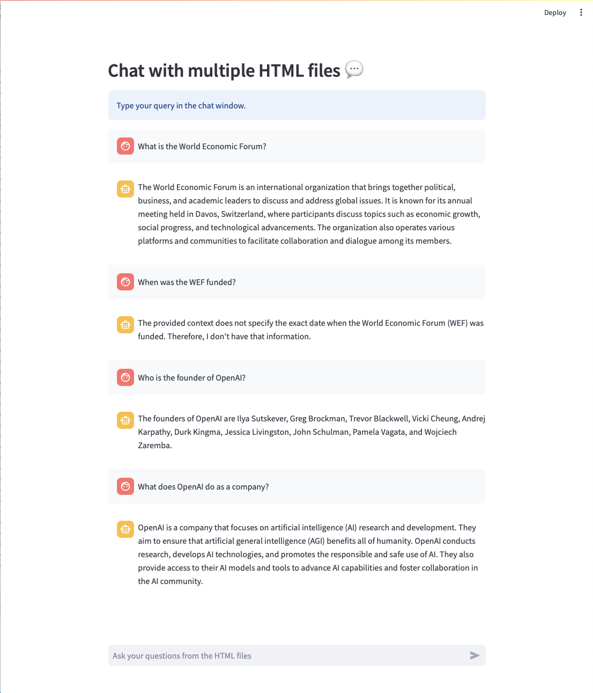
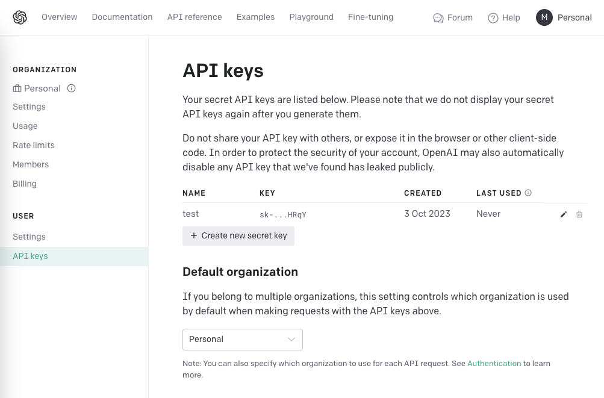

# 🗣 Chat with Your HTML Files

**Turn Static HTMLs into Interactive Chat Sessions!**

With our innovative approach powered by LangChain and Streamlit, your HTML files are no longer just static documents. Now you can:

- 🗣️ **Interactive Chat Sessions**: Bring your files to life and have meaningful dialogues.
- 💾 **Local Storage**: Prioritize your privacy; every interaction is kept on your device.
- 🌐 **Empowered by LLM**: Delve into the advanced tech that drives this experience.
- ✨ **User-Friendly Design**: Engage effortlessly with your files.

  

---

## 📝 Remarks

This Web Application is designed for deployment on [Streamlit](https://streamlit.io/).

---

## 🚀 Quickstart Guide

### 1. Acquire an OpenAI API Key

To host and run the Web App on your local browser, you first need a valid OpenAI API Key. Here's how you can get one:

1. Navigate to OpenAI's official platform at [platform.openai.com](https://platform.openai.com) and sign in.
2. Tap on your profile icon located at the top-right corner and opt for "View API Keys".
3. Hit the "Create New Secret Key" option to generate a fresh API key.
4. Label your API key appropriately and finalize by clicking "Create secret key".
5. Safely store your API key.

  

🔐 **Key Protection Tips**:

- Treat your API key as confidential. Unauthorized access to your key can compromise your OpenAI account and resources.
  
- Collaborate with your key only on platforms you trust.

- Employ distinct API keys for varying services to monitor your usage and detect any potential breaches.

- Make it a habit to assess your API key activities and retire those that aren't active.

### 2. Setting Up the Repository

1. Clone the repository to your system.
2. Rename ".env_example" to ".env" and replace the placeholder with your OpenAI API Key.

    

3. Place your desired HTML files for queries inside the "html_files" folder.

### 3. Preparing the Environment

The `requirements.txt` file lists all the essential Python libraries for this Web App. Install them by running the following command in your terminal:

```bash
pip install -r requirements.txt
```

### 4. Launch on Streamlit

Fire up the web application on your local browser by running the following command in your terminal:

```bash
streamlit run app.py
```
